# SciSpace-Inspired Main Page User Flow for New Researcher MVP

## Purpose

This document updates the previous SciSpace user-flow note into a **SciSpace-like landing / main-page user flow modified for a New Researcher product**.

The goal is not to copy every SciSpace feature. The goal is to keep the **same core interaction model**:

```text
Research intent
→ Task shortcut or prompt
→ Agent interprets task
→ Live task preview
→ Required input / criteria
→ Research workflow execution
→ Citation-backed output
→ Review / refine / export / continue
```

The main modification is:

```text
SciSpace executes research tasks.
Our product guides a new researcher through the research cycle.
```

Additional product requirement:

```text
The right-side panel should visualize the user's research progress, so the student always knows:
- What they are doing
- Where they are in the research cycle
- What artifact has been produced
- What the next recommended step is
```

---

## 1. Product Positioning

### SciSpace positioning

SciSpace feels like a **research task router**.

It starts with:

```text
"How can I help with your research?"
```

Then it gives the user several ways to begin:

```text
Type a question
Click a predefined task card
Open a tool from the sidebar
```

### Modified positioning for our product

Our product should still feel like SciSpace, but with more guidance for beginners.

Main page message:

```text
Where are you in your research journey?
```

or:

```text
How can I help you move your research forward?
```

The product should support users who start with vague intent:

```text
"I want to research anomaly detection."
"I want to do AI in education."
"I have 5 papers but do not know the gap."
```

So the product must not assume the user already knows how to run a literature review.

---

## 2. Core High-Level Flow

This is the main updated flowchart.

It keeps the original SciSpace flow as the core, but adds two things:

1. **New Researcher Guidance**
2. **Right Sidebar Research Progress Preview**

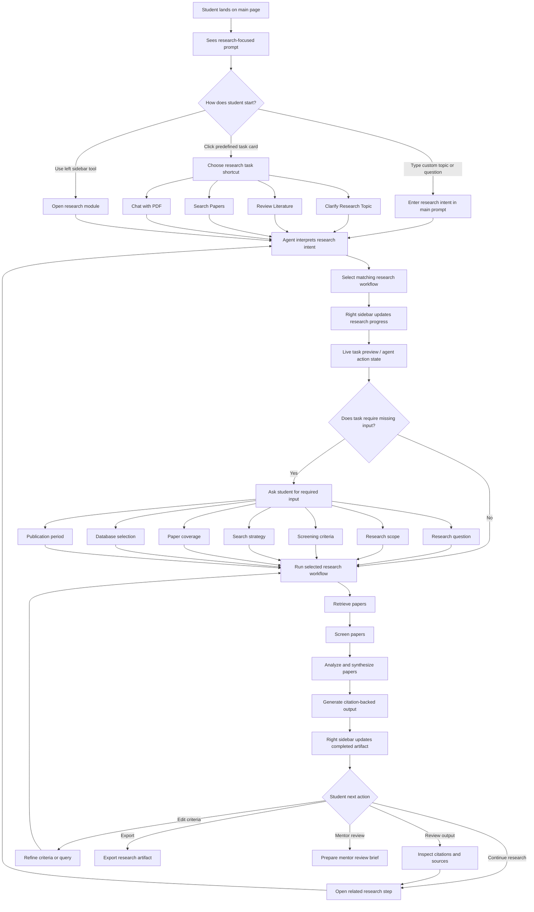

---

## 3. What Stays the Same as SciSpace

The product should keep these SciSpace UX patterns.

### 3.1 Research-first prompt

Do not start with a generic chatbot prompt.

Weak:

```text
Ask me anything.
```

Better:

```text
How can I help with your research?
```

Best for our product:

```text
Where are you in your research journey?
```

### 3.2 Multiple entry points

Just like SciSpace, the user should be able to start in three ways:

```text
1. Type a custom research question
2. Click a predefined task card
3. Open a tool from the sidebar
```

This keeps the user flow familiar and flexible.

### 3.3 Predefined task cards

Task cards reduce blank-page anxiety for beginners.

The student does not need to know the perfect prompt. They can click a task.

### 3.4 Live task preview

The system should show what the agent is doing.

Examples:

```text
Interpreting your topic
Building search strategy
Checking inclusion criteria
Searching papers
Extracting limitations
Building literature matrix
```

### 3.5 Human review before execution

If the workflow needs criteria, search terms, or scope, the product should ask the student to confirm before running.

This keeps the same human-on-the-loop idea from SciSpace.

### 3.6 Citation-backed output

The final answer should show sources.

For the MVP, every important claim should link back to a paper or uploaded source.

---

## 4. What Changes for New Researcher

Only two core changes are needed.

### Change 1 — Add Socratic guidance before execution

SciSpace assumes the user often knows the research task.

Our target user may not.

So before running a workflow, the agent should ask beginner-friendly questions.

Example:

```text
You entered: "anomaly detection from video surveillance."

Before I search papers, please clarify:
1. Do you care about detection, classification, localization, or explanation?
2. Are you focusing on public CCTV, industrial safety, traffic, or healthcare?
3. Do you already have a dataset?
4. Do you want a technical method, a literature review, or a research proposal?
```

### Change 2 — Add right-side research progress preview

The right sidebar is not a feature list.

It is a progress map.

It helps the student understand where they are in the research cycle.

---

## 5. Main Page Layout

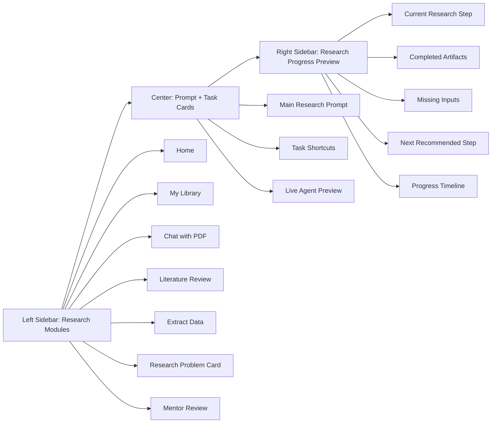

### UI principle

```text
Left sidebar = tools
Center panel = action
Right sidebar = research journey awareness
```

This is the biggest difference from SciSpace.

SciSpace has a feature-rich sidebar. Our product should keep the feature access, but add beginner orientation through the right-side progress preview.

---

## 6. Predefined Task Cards

The task-card structure should stay close to SciSpace.

SciSpace uses mental buckets like:

```text
I want to...
Use...
Make...
```

For our product, adapt them to the New Researcher journey.

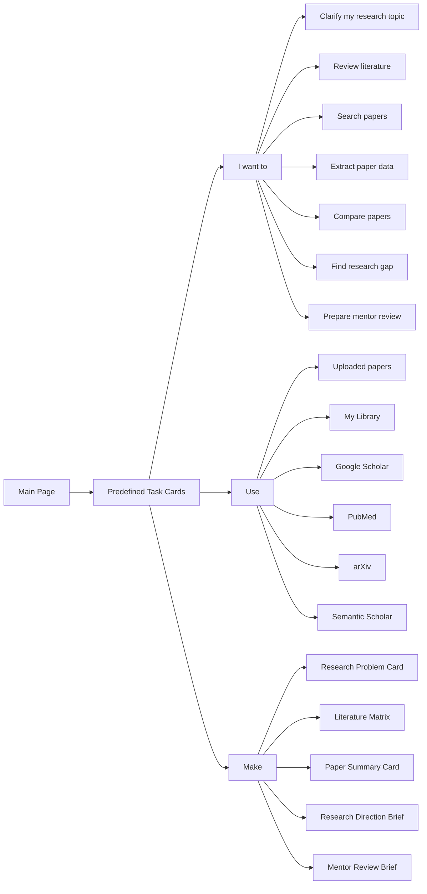

### Why this works

The flow is still SciSpace-like because the user starts from task cards.

But it is modified for beginners because the cards map to research-cycle steps instead of isolated tools.

---

## 7. Right Sidebar Research Progress Flow

This is the most important added feature.

```mermaid
flowchart TD
    A[Right Sidebar: Research Progress] --> B[Current Step Highlight]
    A --> C[Research Cycle Timeline]
    A --> D[Artifacts Completed]
    A --> E[Missing Inputs]
    A --> F[Next Recommended Action]

    C --> C1[1. Clarify Topic]
    C --> C2[2. Define Scope]
    C --> C3[3. Build Search Strategy]
    C --> C4[4. Search Papers]
    C --> C5[5. Screen Papers]
    C --> C6[6. Extract Data]
    C --> C7[7. Build Literature Matrix]
    C --> C8[8. Identify Gap]
    C --> C9[9. Draft Problem Statement]
    C --> C10[10. Mentor Review]

    D --> D1[Research Problem Card]
    D --> D2[Search Strategy]
    D --> D3[Selected Paper Set]
    D --> D4[Literature Matrix]
    D --> D5[Gap Hypothesis]
    D --> D6[Direction Brief]

    E --> E1[Unclear research question]
    E --> E2[No inclusion criteria]
    E --> E3[No uploaded papers]
    E --> E4[Missing citation evidence]

    F --> F1[Answer Socratic question]
    F --> F2[Confirm search criteria]
    F --> F3[Review extracted fields]
    F --> F4[Ask mentor to review]
```

### Right sidebar behavior

The right sidebar should update after every major user action.

Example state:

```text
Current Step:
3. Build Search Strategy

Completed:
- Topic clarified
- Research scope drafted

Missing:
- Inclusion criteria
- Exclusion criteria
- Publication year range

Next Action:
Confirm criteria before searching papers
```

### Why this matters

New researchers often do not know whether they are:

```text
Choosing a topic
Searching papers
Reviewing papers
Finding a gap
Writing a problem statement
```

The right sidebar makes the invisible research process visible.

---

## 8. Research Intent Flow

This keeps the original SciSpace prompt flow but adds guidance.

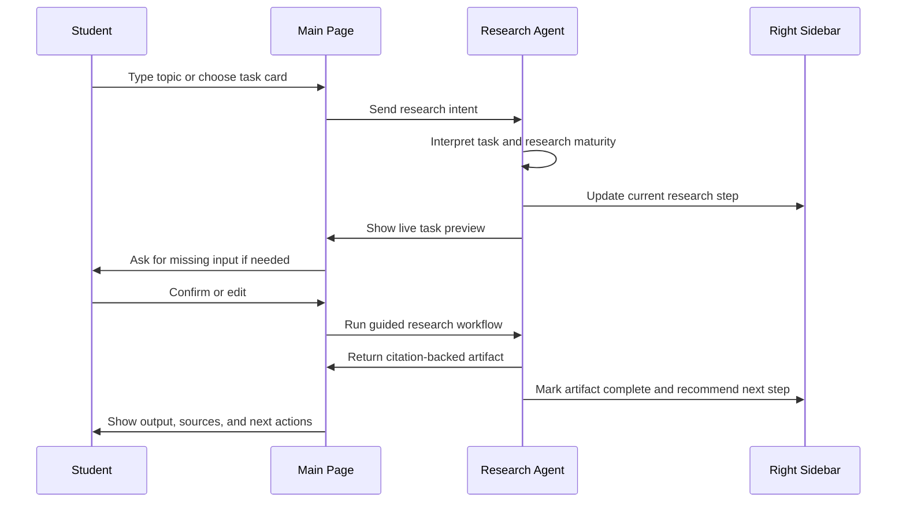

### Detailed behavior

The user can type:

```text
Do a literature review on continual relation extraction.
```

The agent should respond like SciSpace:

```text
I will help you run a literature review.
First, please confirm your screening criteria and search strategy.
```

But for a beginner, it should add:

```text
You are currently at Step 3: Build Search Strategy.
This step controls which papers are included or excluded.
```

---

## 9. Guided Literature Review Flow

This flow remains close to SciSpace's literature review / systematic review flow.

The modification is that the product explains why each step matters.

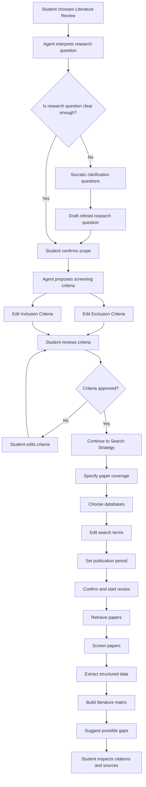

### Why this is still SciSpace-like

It keeps:

```text
Research question
→ Screening criteria
→ Search strategy
→ Paper retrieval
→ Paper analysis
→ Citation-backed output
```

### What is added

It adds:

```text
Socratic clarification
Research-cycle explanation
Literature matrix
Gap hypothesis
```

These are specifically for new researchers.

---

## 10. Screening Criteria Step

### What the user sees

The system asks the student to review and confirm screening criteria.

Fields:

```text
Exclusion Criteria
Inclusion Criteria
```

Example:

```text
Inclusion:
- Papers about video anomaly detection
- Papers using surveillance video datasets
- Papers reporting evaluation metrics
- Papers from 2020 onward

Exclusion:
- Papers about image-only anomaly detection
- Papers without experimental results
```

### Beginner guidance copy

The UI should explain:

```text
Screening criteria decide which papers are relevant.
Good criteria prevent the review from becoming too broad or too noisy.
```

### Human control

The student must review the criteria before search starts.

The AI should not silently decide the scope.

---

## 11. Search Strategy Step

This should stay very close to SciSpace.

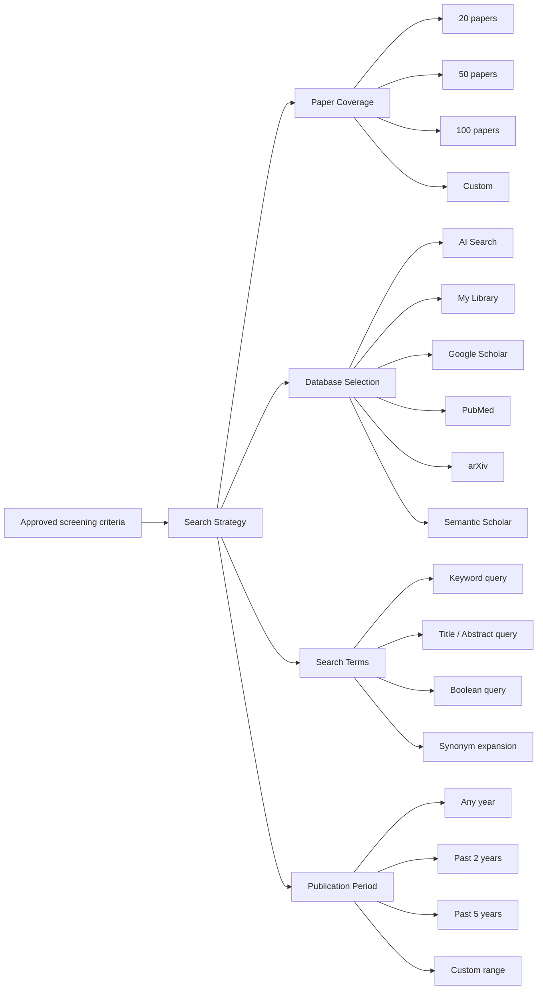

### Beginner guidance copy

```text
Search strategy controls where the system searches and what keywords it uses.
If the search strategy is weak, the literature matrix will also be weak.
```

### MVP default

For MVP, keep the search simple:

```text
20-50 papers
1-3 sources
keyword + synonym expansion
manual paper upload allowed
```

---

## 12. Results and Paper Review Flow

This keeps SciSpace's paper table / library pattern.

Graph visualization can remain low priority.

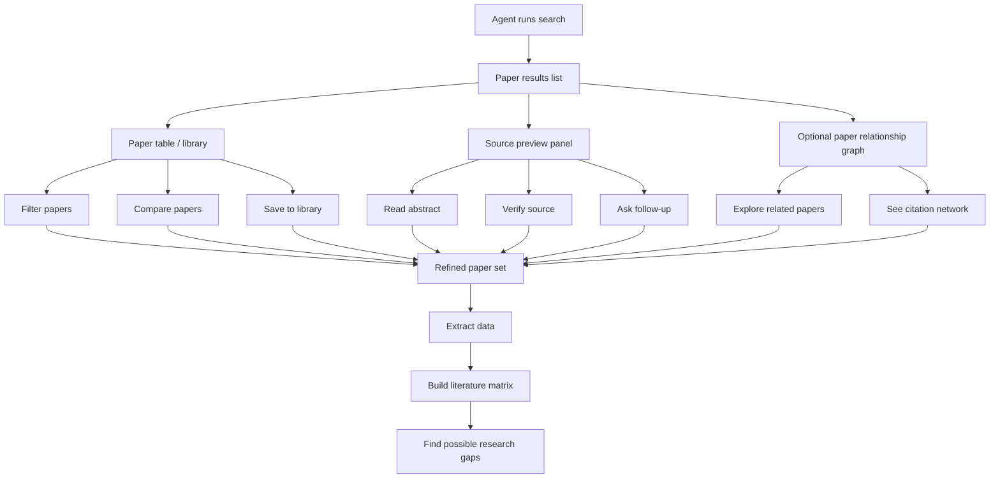

### MVP priority

Prioritize:

```text
Paper table
Source preview
Compare papers
Save to library
Literature matrix
Citation verification
```

Deprioritize:

```text
Citation graph
Advanced visualization
Marketplace
Autonomous agent
```

---

## 13. Structured Extraction Flow

This is where the product becomes different from generic Chat with PDF.

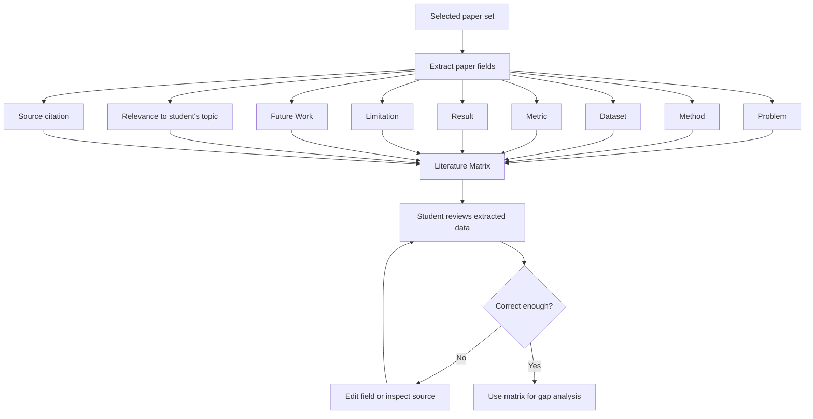

### Human review requirement

AI can extract.

Student must review.

Mentor may review before the research direction is accepted.

---

## 14. Chat with PDF Supporting Flow

This should remain close to SciSpace, but it should support the main research journey.

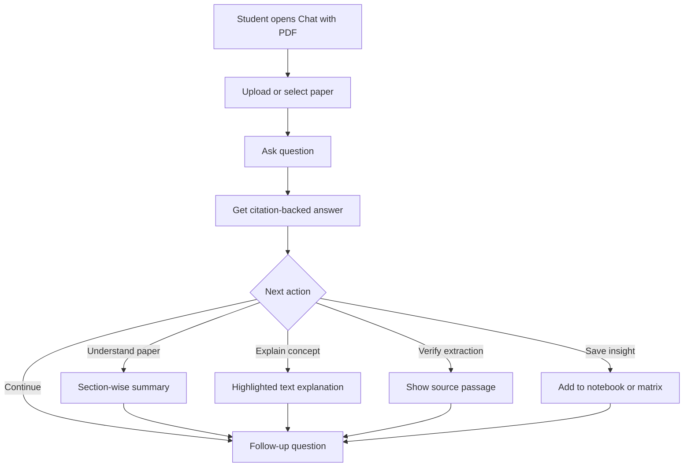

### MVP role

Chat with PDF is useful, but it should not be the main product.

The main product is:

```text
Guided research workflow
```

Chat with PDF is a supporting tool for:

```text
Understanding one paper
Checking a source
Explaining a method
Verifying extracted fields
```

---

## 15. Complete End-to-End Flow

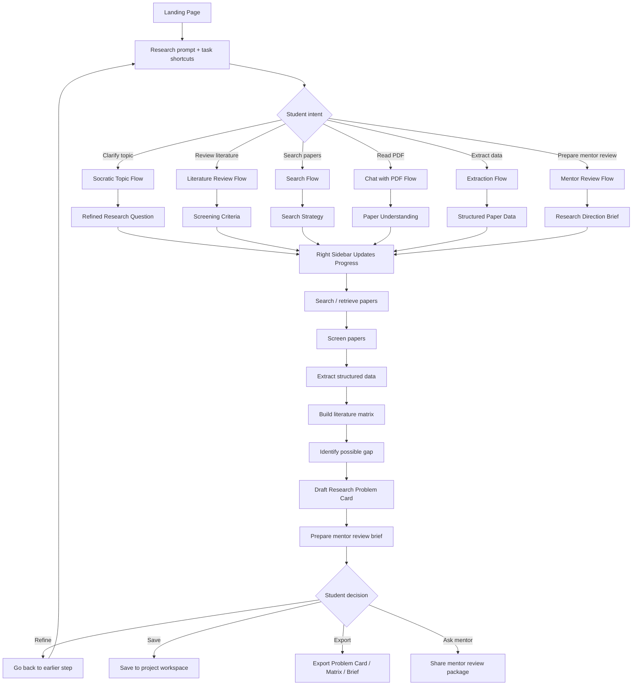

---

## 16. Right Sidebar State Examples

### State 1 — New user with vague topic

```text
Current Step:
1. Clarify Topic

User Input:
"AI for education"

Missing:
- Target learner
- Research context
- Expected output
- Dataset availability

Next Recommended Action:
Answer 4 Socratic questions to narrow the topic
```

### State 2 — User running literature review

```text
Current Step:
3. Build Search Strategy

Completed:
- Research question drafted
- Scope confirmed

Missing:
- Inclusion criteria
- Exclusion criteria
- Publication period

Next Recommended Action:
Review proposed screening criteria
```

### State 3 — User has papers selected

```text
Current Step:
6. Extract Data

Completed:
- Search strategy
- Paper set
- Source preview

Missing:
- Method field
- Dataset field
- Limitation field

Next Recommended Action:
Run structured extraction on selected papers
```

### State 4 — User ready for mentor review

```text
Current Step:
10. Mentor Review

Completed:
- Research Problem Card
- Literature Matrix
- Gap Hypothesis
- Direction Brief

Missing:
- Mentor feedback

Next Recommended Action:
Export mentor review package
```

---

## 17. Main Product Difference from SciSpace

### SciSpace

```text
User knows task
→ SciSpace helps execute
```

Examples:

```text
Review literature
Search papers
Chat with PDF
Extract data
Write draft
```

### Our product

```text
User may not know the research task yet
→ Product guides the user into the right research task
→ Then executes in a SciSpace-like workflow
```

Examples:

```text
Clarify topic
Define scope
Build search strategy
Extract paper fields
Compare papers
Find gap
Prepare mentor review
```

---

## 18. MVP Scope

### Must-have

```text
Research-focused landing prompt
Task cards
Socratic topic clarification
Search strategy builder
Screening criteria editor
Paper table
Structured extraction
Literature matrix
Right progress sidebar
Citation-backed output
Export research artifacts
```

### Should-have

```text
Chat with PDF
Project workspace
Saved library
Mentor review brief
```

### Later

```text
Citation graph
Workflow gallery
Agent marketplace
Autonomous research agent
Code execution
Advanced multi-agent planning
```

---

## 19. Product Boundary

AI may:

```text
Ask clarifying questions
Suggest scope
Suggest inclusion / exclusion criteria
Suggest search terms
Retrieve and summarize papers
Extract structured paper fields
Build literature matrix
Suggest possible gaps
Draft Research Problem Card
```

AI must not:

```text
Claim novelty without evidence
Invent citations
Decide final research direction alone
Replace mentor review
Hide uncertainty
Auto-submit or publish anything
```

Human review required:

```text
Student confirms scope
Student reviews screening criteria
Student verifies extracted paper fields
Mentor reviews final direction
```

Fallback:

```text
If AI is uncertain or sources are weak, the system should stop and ask for more papers, clearer scope, or mentor input.
```

---

## 20. Final Takeaway

The updated product flow should stay close to SciSpace:

```text
Prompt / task cards
→ Agent interprets intent
→ Live task preview
→ Required input
→ Workflow execution
→ Citation-backed output
→ Review / refine / export / continue
```

But it should add the missing beginner layer:

```text
Socratic guidance
Research-cycle explanation
Right sidebar progress visualization
Mentor-reviewable artifacts
```

The final positioning is:

```text
SciSpace-like research workflow,
but designed for students who are still learning how research works.
```

