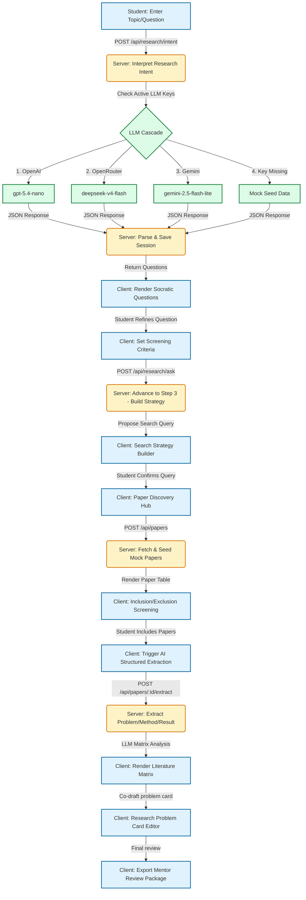

# Project Documentation — New Researcher MVP

This document outlines the system architecture, technology stack, user flow, and the resolution of the recent OpenAI JSON format API error.

---

## 1. Resolution of the OpenAI API Error (400 Bad Request)

### The Error Symptoms
In `error.log`, the following exception occurred when attempting Structured Data Extraction:
```
LLM_API_ERROR: 400 - {
  "error": {
    "message": "'messages' must contain the word 'json' in some form, to use 'response_format' of type 'json_object'."
  }
}
```

### Why It Happened
When calling the Chat Completion API for OpenAI (or OpenAI-compatible providers like OpenRouter) with the option `response_format: { type: 'json_object' }`, the API strictly requires that the word **"json"** (case-insensitive) appears somewhere in the prompt instructions (`messages` array).
- In `llmService.js` (inside `extractPaperFields`), the `systemInstruction` prompt originally read:
  > *"...Extract key fields from the provided paper details (title, year, abstract). For each field, also estimate your confidence..."*
- Because the word "json" was missing from this instruction, the OpenAI API rejected the request before execution and returned a `400 Bad Request` status.

### How We Fixed It
We modified the prompt in `server/src/llmService.js` to explicitly declare the format requirement:
```javascript
const systemInstruction = `You are an expert academic research assistant. Extract key fields from the provided paper details (title, year, abstract) and return them in a structured JSON format. For each field, also estimate your confidence (0-100)...`;
```
This satisfies the API validation rules, enabling successful structured extractions when utilizing active OpenAI/OpenRouter keys.

---

## 2. Technology Stack

The project is structured as a two-process architecture with a clear separation of concerns (Hinge Rule).

| Component | Technology | Role & Purpose |
| :--- | :--- | :--- |
| **Frontend** | React 18 + Vite | Single Page Application (SPA) utilizing plain JSX and inline styles (no Tailwind or custom CSS classes). |
| **Backend** | Node.js + Express | REST API server on port `3001` handling session states and routing. |
| **LLM Gateway** | `llmService.js` | The single gateway (Hinge Rule) managing LLM requests, schema validation, and fallback cascade. |
| **Active Model** | `gpt-5.4-nano` | OpenAI main model for intent classification, Socratic chat, and data extraction. |
| **Fallback 1** | `deepseek-v4-flash` | OpenRouter model invoked if the primary OpenAI model is down or throttled. |
| **Fallback 2** | `gemini-2.5-flash-lite` | Google Gemini model via official SDK used as the final cloud fallback. |
| **In-Memory Store** | `store.js` | Volatile cache holding session states, imported papers, and generated matrix artifacts. |

---

## 3. User Flow Map (Mermaid)

The diagram below outlines the 10-step guided research journey implemented across the Client and Server components:



---

## 4. Architectural Conventions (The Hinge Rule)

- **One Gateway**: All LLM communication goes through `server/src/llmService.js`. The client is completely decoupled and never communicates directly with LLM endpoints.
- **Fail-safe Fallbacks**: If an API key is missing or calls fail twice, the service returns a structured fallback dataset mapping to the student's current step, ensuring the application remains interactive.
- **No Database Configured**: For prototyping convenience, all sessions, literature matrix items, and bookmarked papers are stored in volatile in-memory maps on the server (`server/src/store.js`). Restarting the server resets the application.

---

## 5. Reference User Flow: SciSpace Review Literature Agent

Observed on 2026-06-13 after login, using the SciSpace home task builder rather than the public `/search` landing-page search box.

### Entry Context

- User is logged in and lands on the SciSpace research-agent home screen.
- Primary heading: `How can I help with your research?`
- Main input placeholder: `Give me any task to work on...`
- Below the input is a `Build your task` area with three columns:
  - `I WANT TO`
  - `USE`
  - `MAKE A`
- The `I WANT TO` column includes `Review Literature` as the first action.

### Step-by-Step Flow

1. User clicks `Review Literature` in the `I WANT TO` column.
2. The page does not navigate immediately.
3. The main task input is populated with a prompt template:
   ```text
   Do a Scientific Literature review on __________. Include papers that are __________
   ```
4. The submit button becomes enabled only after the task template appears.
5. User replaces the blanks with a concrete research request.
   Test prompt used:
   ```text
   Do a Scientific Literature review on climate change impacts on biodiversity. Include papers that are peer-reviewed empirical studies and review articles from 2018 onward.
   ```
6. User submits the task while the model mode is set to `Lite`.
7. SciSpace creates a new chat workspace with title `Scientific Literature Review`.
8. URL changes to a persistent chat route:
   ```text
   /chat/a2872f33-6543-4da5-9104-43e9733f9bb9
   ```
9. The chat workspace displays the submitted prompt near the top.
10. The agent shows an execution state labeled `Executing Plan...`.
11. The first plan card is `Searching for literature on climate change impacts on biodiversity`.
12. The agent explains that it is searching for peer-reviewed empirical studies and review articles from 2018 onward.
13. A status row shows `Searching Literature`.
14. The agent expands into a database-search activity list.

### Search Behavior Observed

The agent searched across multiple sources:

- `SciSpace`
- `Scispace Full Text`
- `Google Scholar`
- `Your Library`

The agent generated several search queries, including:

```text
What are the recent impacts of climate change on biodiversity from 2018 onwards?
How does global warming affect species richness and ecosystem stability according to recent studies?
What are the biological responses to anthropogenic climate change in empirical research?
"climate change" AND biodiversity AND (impact OR effect) AND (empirical OR review)
"global warming" AND ("species richness" OR "ecosystem stability") AND (empirical OR review)
"biological responses" AND "anthropogenic climate change" AND (empirical OR review)
```

### Search Results State

After the search phase completed:

- SciSpace searches returned `100 Papers` for each of several queries.
- SciSpace Full Text searches returned `100 Papers` for each of several queries.
- Google Scholar searches returned smaller sets, such as `20 Papers` and `19 Papers`.
- `Your Library` returned `No relevant PDFs found`.
- The agent combined and reranked the results.
- Combined output shown:
  ```text
  Combined and reranked results: climate change impacts on biodiversity - 197 Papers
  ```

### Filtering and Table Creation

After combining results:

1. The agent entered a `Filtering and refining search results` stage.
2. It stated that it had retrieved `197 unique papers`.
3. It filtered the set to include only papers from `2018 onwards`.
4. It created a paper table:
   ```text
   /home/sandbox/combined_climate_biodiversity.papertable
   ```
5. The agent began report generation.
6. It read the `combined_climate_biodiversity` table.
7. It added extraction columns, including:
   ```text
   study_design_and_methods
   biodiversity_impacts_and_findings
   ```

### Running State Controls

While the agent is running:

- The bottom input changes to a follow-up/interrupt box with placeholder:
  ```text
  Stop or give instructions...
  ```
- `Quick actions` and tool selection are disabled.
- The mode selector remains visible but disabled.
- A `Stop agent` button appears.
- The UI status says `Agent is running...`

### Credit Exhaustion State

The run stopped before final report completion because credits were exhausted.

Visible message:

```text
Agent is on a coffee break
You have exhausted your available credits. To continue using SciSpace Agent, upgrade to a higher plan.
```

Visible recovery action:

```text
Upgrade Now
```

### UX Notes for Future UI/UX Work

- The `Review Literature` action is discoverable in the task builder, but the first click only inserts a prompt template. There is no immediate explanation that the user must complete the blanks before submitting.
- The generated template is useful because it teaches the user the expected structure: topic plus paper inclusion constraints.
- The flow becomes much clearer after submission: the agent exposes plan execution, search sources, query expansion, paper counts, filtering, and table generation.
- The transparency of the search phase is strong: users can see which databases were searched and how many papers were found.
- The system successfully translates a natural-language review request into multiple search queries and a structured paper table.
- The run can stop mid-generation due to credit exhaustion, after search and extraction work has already started. This should be disclosed before submission if the same pattern is used in our own UI.
- A research-workflow UI inspired by this should show estimated credit/time cost before execution, preserve partial artifacts after interruption, and clearly distinguish `search complete`, `filtering complete`, `extraction running`, and `report generation blocked`.
