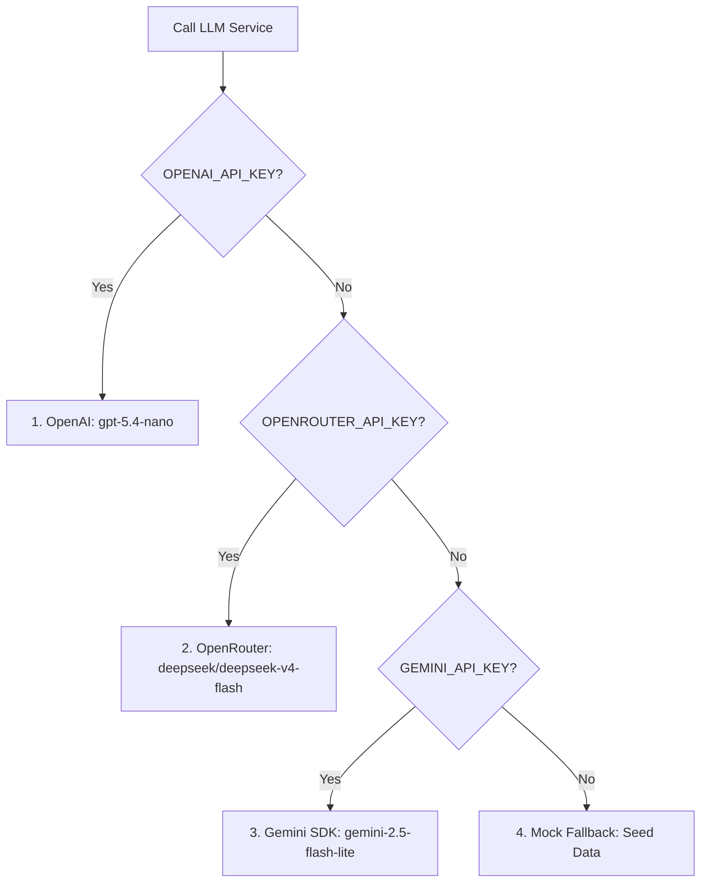

# E2E API Integration Test Suite Documentation

This document describes the design, coverage, and execution of the backend integration test suite for the **New Researcher MVP**. The tests validate Socratic chats, paper screening, structured extractions, and artifact exports using Node.js's native test runner (`node:test`).

---

## 🛠️ Testing Framework

We use Node.js's built-in `node:test` runner and `node:assert` library. This has several key advantages:
1. **Zero External Dependencies**: Standard Node.js 18+ includes these testing modules natively.
2. **ES Module Syntax**: Fully compatible with `"type": "module"` in `package.json` without extra loaders like Babel or ts-node.
3. **Execution Speed**: The test suite runs in under 2 seconds.

### Isolated Test Server
To prevent conflicts with ports or databases, the test suite boots an isolated Express instance on **port 3002** during `test.before` and tears it down during `test.after`.

---

## 📝 Detailed Test Cases

The test suite covers **10 integration scenarios** mapping to the core user stories:

### 1. Session Start API Endpoint
- **Endpoint**: `POST /api/research/start`
- **Purpose**: Verifies that a new session is correctly initialized on the server with a given `session_id`.
- **Assertions**: 
  - Status is `200`.
  - The returned `session_id` matches the input.
  - The `current_step` defaults to step `1` (Clarify Topic).

### 2. Socratic Chat Ask Endpoint (Clarify Topic)
- **Endpoint**: `POST /api/research/ask`
- **Purpose**: Verifies that submitting a topic triggers the Socratic clarification agent.
- **Assertions**:
  - Status is `200`.
  - The agent responds with Socratic questions.
  - The metadata contains `step: "clarify_topic"`, citations, and follow-up chips.

### 3. Progress Tracker Endpoint
- **Endpoint**: `GET /api/research/progress`
- **Purpose**: Assures that the progress tracker returns a 10-step timeline status.
- **Assertions**:
  - The `steps` array contains exactly 10 step configurations.
  - Progress percentages and quality metrics are initialized correctly.

### 4. Papers Database Listing and Seeding
- **Endpoint**: `GET /api/papers`
- **Purpose**: Checks if requesting the papers list automatically seeds the session with the 8 realistic mock papers.
- **Assertions**:
  - Returns exactly 8 papers.
  - Verification of keys like `title`, `abstract`, `relevance_score` and `source`.

### 5. Update Paper Screening Status (Include/Exclude)
- **Endpoint**: `PATCH /api/papers/:id`
- **Purpose**: Validates the screening cycle where a student manually includes or excludes papers.
- **Assertions**:
  - The screening badge updates to `included`.
  - Re-fetching the list shows the status persists.

### 6. AI Structured Extraction Endpoint
- **Endpoint**: `POST /api/papers/:id/extract`
- **Purpose**: Triggers structured extraction of 9 variables from a paper abstract.
- **Assertions**:
  - Returns `success: true`.
  - The paper details are populated with Problem, Method, Result, and Citation.

### 7. Manual Field Edits & Confidence Reversion
- **Endpoint**: `PUT /api/papers/:id/fields`
- **Purpose**: Validates human override capabilities. If a student modifies an extracted field, the confidence indicator reverts to manual.
- **Assertions**:
  - The modified field contains the new value.
  - The confidence score for the edited field is set to `-1` (reverting to a blue user-edited badge).

### 8. Paper Library Bookmark Actions
- **Endpoints**: `POST /api/library/add`, `GET /api/library/list`, `POST /api/library/remove`
- **Purpose**: Validates bookmarking papers to "My Library" and counts saved items.
- **Assertions**:
  - Bookmark lists contain the added paper ID.
  - Removal successfully clears the ID from the list.

### 9. Artifacts Management & Retrieval
- **Endpoints**: `POST /api/artifacts/synthesis`, `GET /api/artifacts`
- **Purpose**: Assures research outputs like the final Problem Card are persisted to the server.
- **Assertions**:
  - The saved Problem Card contains the correct problem statements, gaps, and directions.

### 10. API Error Validation (Missing Session ID)
- **Endpoint**: `POST /api/research/ask`
- **Purpose**: Tests backend robustness.
- **Assertions**:
  - Status is `400` (Bad Request) if the body lacks a `session_id`.
  - Returns a clear error string.

---

## 🚀 How to Run the Tests

Go to the `server/` directory and run:
```bash
npm run test
```

---

## 🧠 LLM API Providers Cascade

The backend (`llmService.js`) implements a provider-lookup cascade to execute queries. When a call is made, it checks keys in this order:



### Double-Failure & Invalid Credentials Recovery
- If an API key is present but invalid (e.g. OpenAI returning `401 Unauthorized`), the service logs the error, attempts **one automatic retry**, and on the second failure **automatically falls back to mock seed data**.
- This guarantees the application and tests continue to function gracefully during offline work or local prototype testing.
