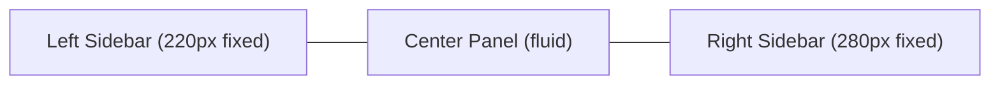
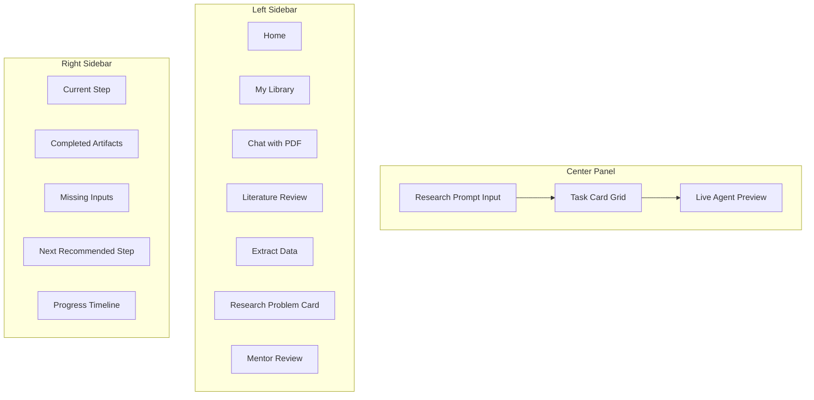
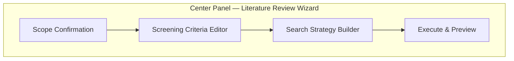
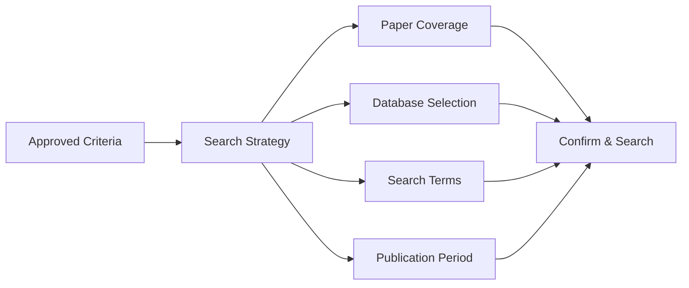
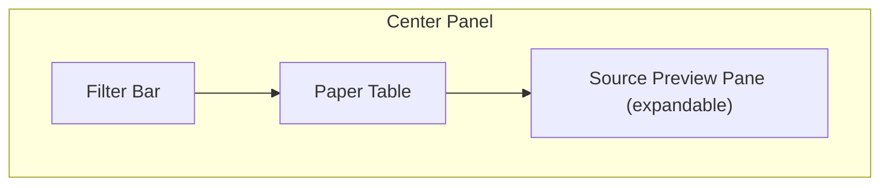
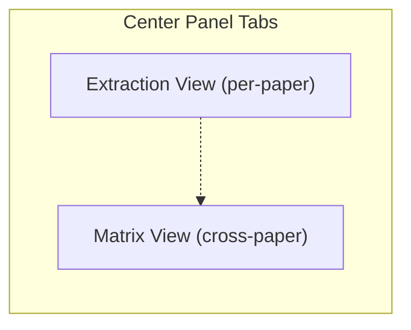
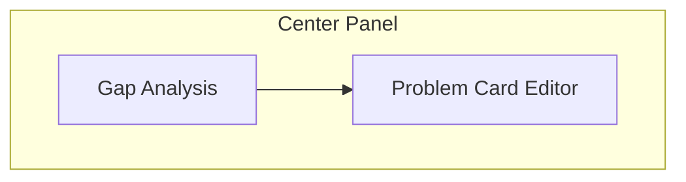
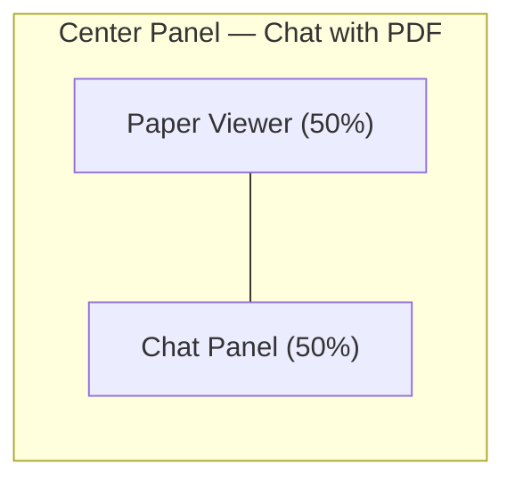
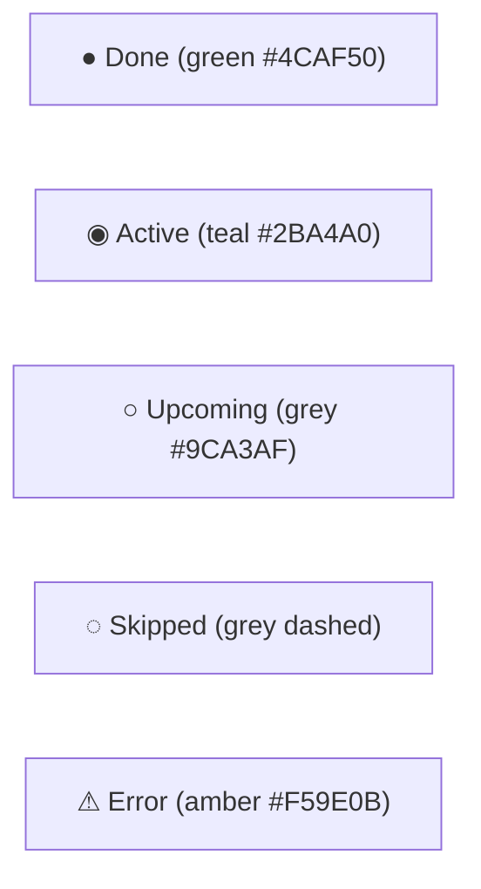
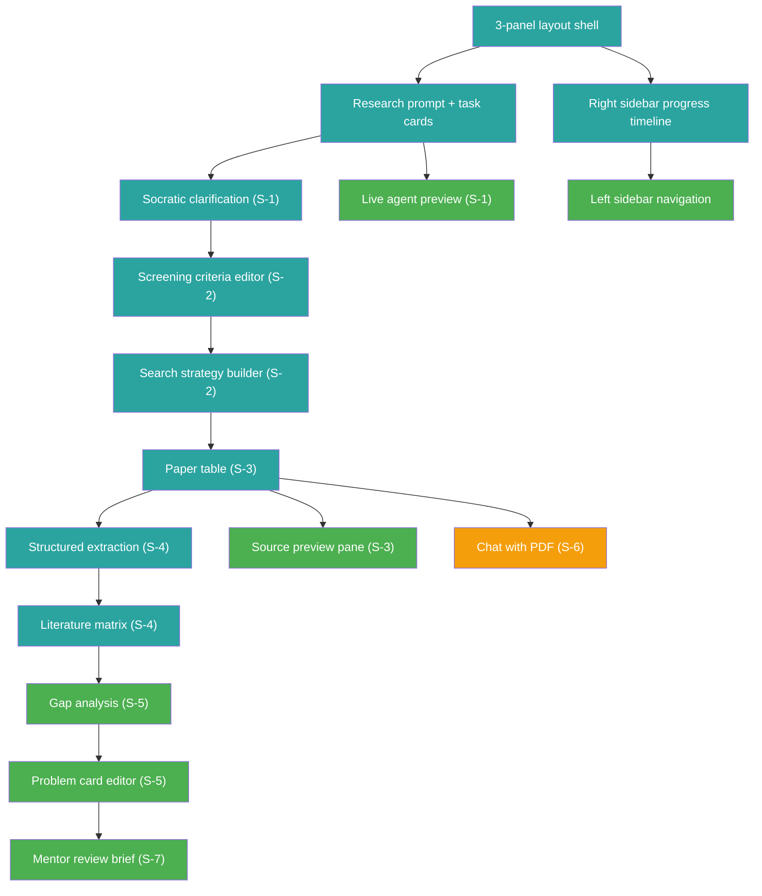

# New Researcher MVP — Screen Specification

## 1. Overview

### Product positioning

A SciSpace-inspired research guidance tool for new graduate students and early-career researchers. The product keeps the SciSpace core interaction model — prompt → agent → preview → output — but adds a beginner layer: Socratic guidance before execution, a 10-step research cycle framework, and a persistent progress sidebar so the student always knows where they are.

```text
SciSpace executes research tasks for experienced researchers.
This product guides a new researcher through the research cycle, then executes.
```

### Layout: 3-panel



| Panel | Width | Role | Content |
|-------|-------|------|---------|
| **Left sidebar** | ~220px fixed | Tool navigation | Home, My Library, Chat with PDF, Literature Review, Extract Data, Research Problem Card, Mentor Review |
| **Center panel** | fluid (remaining) | Primary action area | Research prompt, Task card shortcuts, Live agent preview, Screen-specific workflow content |
| **Right sidebar** | ~280px fixed | Research journey awareness | Current Step, Completed Artifacts, Missing Inputs, Next Recommended Step, Progress Timeline |

**Principle:** Left = tools. Center = action. Right = awareness.

### Research Cycle (10 steps)

| Step | Name | Key Artifact |
|------|------|--------------|
| 1 | Clarify Topic | Focused research question |
| 2 | Define Scope | Inclusion/exclusion criteria, domain, date range |
| 3 | Build Search Strategy | Boolean query, keyword synonyms, database list |
| 4 | Search Papers | Retrieved paper list with metadata |
| 5 | Screen Papers | Included/excluded papers with reasons |
| 6 | Extract Data | Structured fields per paper |
| 7 | Build Literature Matrix | Cross-paper comparison table |
| 8 | Identify Gap | Evidence-backed gap statement |
| 9 | Draft Problem Statement | Research Problem Card |
| 10 | Mentor Review | Mentor Review Brief + feedback checklist |

### Entry points

Every session begins from one of three entry points:

```text
1. Type a research intent into the center prompt
2. Click a predefined task card
3. Open a research module from the left sidebar
```

---

## 2. Screen S-1 — Main Research Page

The landing page. The student sees this on every visit. All research journeys start here.

### Trigger

Student opens the app (root route `/`). No auth required.

### Layout

Full 3-panel layout. Center panel contains three vertical sections: Research Prompt → Task Card Grid → Live Agent Preview.



### Components

#### C1 — Research Prompt

| Property | Value |
|----------|-------|
| Element | Large text input with submit button |
| Placeholder text | "What research topic are you exploring today?" |
| Max length | 500 characters |
| Submit action | `POST /api/sessions/:id/clarify` |
| Keyboard shortcut | `Enter` to submit (Shift+Enter for newline) |

#### C2 — Task Card Grid

Three card groups arranged horizontally. Each card is a white surface on `#F7F9FC` background, 8px radius, 1px `#E5E7EB` border.

| Group | Cards |
|-------|-------|
| **I want to…** | Clarify my research topic · Review literature · Search papers · Extract paper data · Compare papers · Find research gap · Prepare mentor review |
| **Use…** | Uploaded papers · My Library · Google Scholar · PubMed · arXiv · Semantic Scholar |
| **Make…** | Research Problem Card · Literature Matrix · Paper Summary Card · Research Direction Brief · Mentor Review Brief |

Card click → routes to the matching workflow screen or opens inline Socratic clarification in the Agent Preview area.

#### C3 — Live Agent Preview

Shows real-time agent activity below the task cards. Appears only when the agent is working.

| Element | Description |
|---------|-------------|
| Status label | Current action text (e.g., "Interpreting your topic…", "Building search strategy…") |
| Step indicator | "Step 3 of 10: Build Search Strategy" |
| Streaming output | Agent's text streams in progressively |
| Stop button | Red outline button "Stop" — cancels in-progress agent task via AbortController |
| Transition | When agent completes, output area becomes interactive (edit / confirm / continue) |

#### C4 — Left Sidebar Navigation

Vertical nav list. Each item: icon (outline Lucide) + label. Active item highlighted with teal `#2BA4A0` left border and tinted background.

| Item | Route/Action | Icon |
|------|-------------|------|
| Home | `/` — returns to main page | `Home` |
| My Library | Opens saved paper library view | `BookOpen` |
| Chat with PDF | Opens S-6 Chat with PDF | `MessageSquare` |
| Literature Review | Opens S-2 Literature Review Workflow | `Search` |
| Extract Data | Opens S-4 Structured Extraction | `Table` |
| Research Problem Card | Opens S-5 Problem Card Editor | `FileText` |
| Mentor Review | Opens S-7 Mentor Review Brief | `UserCheck` |

#### C5 — Right Sidebar: Research Progress

Always visible. Updates after every major user action.

| Element | Description |
|---------|-------------|
| **Current Step** | Highlighted step number + name (e.g., "Step 1: Clarify Topic"). Teal `#2BA4A0` accent. |
| **Completed Artifacts** | Checklist with green ✅ icons. Items: Research Question, Scope Criteria, Search Strategy, Paper Set, Screening Results, Extracted Data, Literature Matrix, Gap Hypothesis, Problem Card, Mentor Brief. |
| **Missing Inputs** | Amber ⚠️ icons. Lists what the student still needs to provide for the current step. |
| **Next Recommended Step** | Single action suggestion with a clickable link/button (e.g., "Answer 4 Socratic questions to narrow the topic"). |
| **Progress Timeline** | Vertical 10-step timeline. ● green filled = done, ◉ teal ring = active, ○ grey outline = upcoming. Clickable — student can jump to any completed or active step. |

### States

| State | Center Panel | Right Sidebar | Agent Preview |
|-------|-------------|---------------|---------------|
| **Idle (new session)** | Prompt + task cards visible. No previous output. | Step 1 active. No artifacts. Missing: topic, scope, criteria. Next: "Type your research topic." | Hidden |
| **Prompt submitted** | Prompt disabled. Cards fade. Agent preview appears. | Step updates to match interpreted task. | Visible — streaming "Interpreting your topic…" |
| **Socratic Q&A** | Agent preview shows clarifying questions. Student types answers inline. | Step 1 active. Missing inputs update as answers arrive. | Active — shows questions, awaits student input |
| **Workflow running** | Agent preview shows progress (e.g., "Searching 50 papers across Google Scholar, arXiv…"). | Current step animates. | Active — streaming status + partial results |
| **Output ready** | Agent preview replaced by structured output (e.g., refined question, paper table, matrix). Edit/confirm/continue buttons visible. | Artifact marked ✅. Next step recommended. | Collapsed — output replaces preview |
| **Error** | Red error card: icon ⚠️ + message + "Retry" button + "Simplify and retry" link. | Step shows amber ⚠️. Missing input unchanged. | Shows error state |

### Entry / Exit points

| Direction | Point |
|-----------|-------|
| **Entry** | App load (root route), Return from any screen via left sidebar Home link |
| **Exit to S-2** | Click "Review literature" card or Literature Review sidebar item |
| **Exit to S-3** | Click "Search papers" card or agent completes search → paper table |
| **Exit to S-4** | Click "Extract paper data" card or Extract Data sidebar item |
| **Exit to S-5** | Click "Research Problem Card" card or sidebar item |
| **Exit to S-6** | Click "Chat with PDF" card or sidebar item |
| **Exit to S-7** | Click "Prepare mentor review" card or sidebar item |

### Data shown

- Session metadata (id, created_at, current_step)
- Latest agent output (streaming or completed)
- Right sidebar progress state from `GET /api/sessions/:id/progress`
- Task card availability (some cards disabled until prerequisites met)

---

## 3. Screen S-2 — Literature Review Workflow

The guided literature review screen. Covers Steps 2–5 of the research cycle: Define Scope → Build Search Strategy → Search Papers → Screen Papers.

### Trigger

Student clicks "Review literature" task card, selects Literature Review from sidebar, or agent routes here after topic clarification (Step 1 complete).

### Layout

Center panel replaces task cards with a vertical workflow wizard. Left and right sidebars remain.



### Components

#### C1 — Scope Confirmation Panel (Step 2)

| Element | Description |
|---------|-------------|
| Research question display | Shows the clarified research question from Step 1 (editable) |
| Scope fields | Domain, Population/Context, Time range, Geographic scope |
| Agent suggestion | AI proposes default scope with explanation; student confirms or edits |
| Confirm button | "Confirm Scope" — saves artifact, advances to Step 3 |
| Guidance text | "Scope controls what is included in your review. A narrower scope produces more focused results." |

#### C2 — Screening Criteria Editor (Step 2–3)

Two-column editable list: Inclusion Criteria (left) and Exclusion Criteria (right).

| Element | Description |
|---------|-------------|
| Inclusion list | Editable text items. Agent pre-fills 3–5 suggested criteria. Each item has edit/delete controls. |
| Exclusion list | Same format. Agent pre-fills 2–4 exclusion items. |
| Add button | "+ Add criterion" at the bottom of each column |
| Agent rationale | Below each suggested criterion, grey italic text explaining why it was suggested |
| Guidance text | "Screening criteria decide which papers are relevant. Good criteria prevent the review from becoming too broad or too noisy." |
| Confirm button | "Approve Criteria" — locks criteria, advances to search strategy |

#### C3 — Search Strategy Builder (Step 3)

Four configuration sections in a card-based layout.

| Section | Options | Default |
|---------|---------|---------|
| **Paper Coverage** | Radio: 20 / 50 / 100 / Custom (number input) | 20 |
| **Database Selection** | Checkbox list: AI Search, My Library, Google Scholar, PubMed, arXiv, Semantic Scholar | AI Search + Google Scholar |
| **Search Terms** | Editable tag list. Agent generates keyword query + Boolean operators + synonym expansion. Student can add/remove/edit. | Agent-generated from research question |
| **Publication Period** | Radio: Any year / Past 2 years / Past 5 years / Custom range (year pickers) | Past 5 years |



| Element | Description |
|---------|-------------|
| Preview panel | Shows the constructed Boolean query string that will be sent |
| Human review checkpoint | Student must click "Confirm and Start Search" before any retrieval begins |
| Guidance text | "Search strategy controls where the system searches and what keywords it uses. If the search strategy is weak, the literature matrix will also be weak." |

#### C4 — Search Execution Preview (Step 4)

| Element | Description |
|---------|-------------|
| Progress bar | "Searching… 32 of 50 papers retrieved" |
| Database status | Per-database indicator: ✅ Google Scholar (18 found), ⏳ arXiv (searching…), ❌ PubMed (timeout) |
| Stop button | Cancel search mid-execution |
| Transition | On completion → navigates to S-3 Paper Table |

### States

| State | Criteria Editor | Strategy Builder | Execution |
|-------|----------------|-----------------|-----------|
| **Idle** | Empty criteria lists, awaiting agent suggestion | Hidden (not yet reached) | Hidden |
| **Agent suggesting** | Agent streams suggested criteria with rationale | Hidden | Hidden |
| **Student editing** | Criteria editable, confirm button active | Hidden | Hidden |
| **Criteria approved** | Criteria locked (edit button to reopen) | Visible, agent pre-fills strategy | Hidden |
| **Strategy confirmed** | Locked | Locked, preview shows final query | Visible — search running |
| **Search complete** | Locked | Locked | Shows result summary → transition to S-3 |
| **Error (search fail)** | Locked | Editable (to retry with different params) | Red error card + "Retry" + "Try different databases" |

### Entry / Exit points

| Direction | Point |
|-----------|-------|
| **Entry** | From S-1 task card "Review literature", sidebar Literature Review, or agent routing after Step 1 |
| **Exit to S-3** | Search completes → paper table |
| **Exit to S-1** | Click Home in sidebar |
| **Back** | Student clicks any completed step in right sidebar timeline to revisit |

### Data shown

- Research question (from Step 1 artifact)
- Scope criteria (from Step 2 artifact)
- Agent-suggested screening criteria and search terms
- Search execution progress and database status
- Right sidebar: Steps 2–4 progress, missing inputs for current sub-step

---

## 4. Screen S-3 — Paper Table & Review

The paper management screen. Student reviews retrieved papers, screens them, previews sources, and saves selections to the library.

### Trigger

Search execution completes on S-2, student clicks "Search papers" card, or student opens My Library from sidebar.

### Layout

Center panel shows a full-width data table with an optional split-pane source preview below or to the right.



### Components

#### C1 — Filter Bar

| Element | Description |
|---------|-------------|
| Screening status filter | Tabs: All / Included / Excluded / Pending |
| Source filter | Dropdown: All sources / Google Scholar / PubMed / arXiv / Semantic Scholar / Uploaded |
| Year range filter | Slider or dropdown: min year – max year |
| Search box | Text search across title, authors, abstract |
| Sort | Dropdown: Relevance / Year (newest) / Year (oldest) / Title A–Z |
| Paper count | "24 papers · 12 included · 8 excluded · 4 pending" |

#### C2 — Paper Table

Scrollable table. Each row represents one paper.

| Column | Content |
|--------|---------|
| **Select** | Checkbox for bulk actions |
| **Screening** | Status badge: 🟢 Included / 🔴 Excluded / ⚪ Pending. Clickable to toggle. |
| **Title** | Paper title (clickable → opens source preview). Bold. |
| **Authors** | First author + "et al." if >2 authors |
| **Year** | Publication year |
| **Source** | Database icon + name |
| **Relevance** | Agent-assigned relevance score: High / Medium / Low (color-coded) |
| **Abstract** | 2-line truncated abstract. Expand on hover/click. |
| **Actions** | Icon buttons: Preview (eye) · Save to Library (bookmark) · Extract (table icon) · Chat (message) |

#### C3 — Source Preview Pane

Expands when a paper row is clicked or preview icon is used.

| Element | Description |
|---------|-------------|
| Full abstract | Complete abstract text |
| Metadata | Authors, year, venue, DOI/URL, citation count |
| Agent screening note | Why the agent thinks this paper matches/doesn't match criteria |
| Include/Exclude buttons | Large action buttons with reason text field |
| Quick actions | "Extract from this paper" → S-4, "Chat with this paper" → S-6, "Save to Library" |

#### C4 — Bulk Actions Bar

Appears when one or more checkboxes are selected.

| Action | Description |
|--------|-------------|
| Include selected | Mark all selected as Included |
| Exclude selected | Mark all selected as Excluded |
| Extract selected | Queue selected papers for structured extraction (→ S-4) |
| Compare selected | Open side-by-side comparison view (max 4 papers) |

#### C5 — Compare View (modal or split pane)

| Element | Description |
|---------|-------------|
| Layout | 2–4 papers side by side in columns |
| Fields shown | Title, Abstract, Method summary, Key findings (if extracted) |
| Action | "Include" / "Exclude" per paper, "Extract all" button |

### States

| State | Table | Preview | Bulk Actions |
|-------|-------|---------|--------------|
| **Empty** | "No papers yet. Run a search first." with link to S-2. | Hidden | Hidden |
| **Loaded (all pending)** | All rows show ⚪ Pending status. Agent relevance scores visible. | Hidden | Hidden |
| **Screening in progress** | Mix of 🟢/🔴/⚪ statuses. Filter tabs show counts. | Visible when row selected | Visible when checkboxes checked |
| **Screening complete** | All papers screened. "Proceed to extraction" banner at top. | Available | Available |
| **Error (paper load fail)** | Error row with retry button for failed source | N/A | N/A |

### Entry / Exit points

| Direction | Point |
|-----------|-------|
| **Entry** | From S-2 search completion, S-1 "Search papers" card, sidebar My Library |
| **Exit to S-4** | Click "Extract" on paper or "Extract all included" bulk action |
| **Exit to S-6** | Click "Chat" icon on a paper row |
| **Exit to S-2** | Click "Refine search" button → returns to search strategy with current criteria |
| **Exit to S-1** | Sidebar Home |

### Data shown

- Paper list from `GET /api/sessions/:id/papers`
- Screening status per paper
- Agent relevance scores and screening notes
- Filter/sort state (client-side on loaded data)
- Right sidebar: Step 4–5 progress, included/excluded count, missing screening decisions

---

## 5. Screen S-4 — Structured Extraction & Literature Matrix

Two connected views: per-paper field extraction (Step 6) and cross-paper matrix (Step 7).

### Trigger

Student clicks "Extract paper data" card, selects "Extract Data" from sidebar, or uses "Extract" action on a paper in S-3.

### Layout

Center panel has a tab switcher at the top: **Extraction View** | **Matrix View**.



### Components — Extraction View

#### C1 — Paper Selector

| Element | Description |
|---------|-------------|
| Dropdown / list | Select from included papers. Shows extraction status: ✅ Extracted / ⏳ Pending / ✏️ In Progress |
| Navigation | "← Previous" / "Next →" arrows to step through papers |
| Progress | "Extracted 4 of 12 papers" |

#### C2 — Extraction Fields Card

A structured form showing the 9 extraction fields for the selected paper. Agent auto-fills fields; student reviews and edits.

| Field | Type | Description |
|-------|------|-------------|
| **Problem** | Textarea | Research problem or question the paper addresses |
| **Method** | Textarea | Methodology, approach, or technique used |
| **Dataset** | Textarea | Data sources, corpora, or sample described |
| **Metric** | Textarea | Evaluation metrics or measures reported |
| **Result** | Textarea | Key findings and quantitative outcomes |
| **Limitation** | Textarea | Stated limitations or threats to validity |
| **Future Work** | Textarea | Suggested future directions by the authors |
| **Relevance** | Textarea | How this paper relates to the student's research question |
| **Source Citation** | Text input (read-only, agent-filled) | Full citation string: author, year, title, venue |

Each field shows:
- **Confidence badge**: High (green) / Medium (amber) / Low (red) — per field
- **Source passage link**: Click to see the exact text in the paper that this extraction is based on
- **Edit indicator**: Pencil icon when student has modified agent's extraction

#### C3 — Extraction Actions

| Action | Description |
|--------|-------------|
| "Run Extraction" | `POST /api/sessions/:id/extract` — agent fills all 9 fields for selected paper |
| "Verify All" | Mark all fields as student-reviewed |
| "Save & Next" | Save current paper, advance to next unextracted paper |
| "View Source" | Opens the paper abstract / full text in a side panel for manual verification |

### Components — Matrix View

#### C4 — Literature Matrix Table

A wide scrollable table. Rows = included papers. Columns = extraction fields.

| Column | Content |
|--------|---------|
| **Paper** | Title (truncated) + year. Clickable → opens Extraction View for that paper. |
| **Problem** | Extracted problem (truncated, tooltip for full text) |
| **Method** | Extracted method |
| **Dataset** | Extracted dataset |
| **Metric** | Extracted metric |
| **Result** | Extracted result |
| **Limitation** | Extracted limitation |
| **Future Work** | Extracted future work |
| **Relevance** | Extracted relevance |

#### C5 — Matrix Actions

| Action | Description |
|--------|-------------|
| Sort by column | Click column header to sort alphabetically or by confidence |
| Filter rows | Filter by verification status (verified / unverified) |
| Export matrix | Download as CSV / Markdown table |
| "Analyze for Gaps" | `POST /api/sessions/:id/gap` — agent scans matrix and generates gap hypotheses → routes to S-5 |
| Add annotation | Student can add a note per cell or per row |

### States

| State | Extraction View | Matrix View |
|-------|----------------|-------------|
| **No papers included** | "No papers to extract. Screen papers first." Link to S-3. | Empty table. Same message. |
| **Papers selected, not extracted** | Paper selector visible. Fields empty. "Run Extraction" button prominent. | Table shows paper names but all cells empty. |
| **Extraction running** | Fields fill in progressively (streaming). Confidence badges appear. "Extracting Problem field…" status. | Corresponding row updates live. |
| **Extraction complete, unverified** | All fields filled. Amber border on unverified fields. "Verify All" button visible. | Full table. Unverified cells have amber dot. |
| **All verified** | Green border on all fields. "Save & Next" or "Go to Matrix" buttons. | All cells clean. "Analyze for Gaps" button prominent. |
| **Error (extraction fail)** | Error message per field or whole card. "Retry" button. "Try with shorter abstract" suggestion. | Partial row data. Error indicator in failing cells. |

### Entry / Exit points

| Direction | Point |
|-----------|-------|
| **Entry** | From S-3 "Extract" action, S-1 "Extract paper data" card, sidebar Extract Data |
| **Exit to S-5** | Click "Analyze for Gaps" after matrix is populated |
| **Exit to S-6** | Click "View Source" → opens Chat with PDF for that paper |
| **Exit to S-3** | Click "Add more papers" → returns to paper table |
| **Exit to S-1** | Sidebar Home |

### Data shown

- Selected paper metadata and full abstract
- Extracted fields from `POST /api/sessions/:id/extract`
- Confidence indicators per field
- Full matrix from `GET /api/sessions/:id/matrix`
- Right sidebar: Steps 6–7 progress, count of extracted/verified papers, missing extractions

---

## 6. Screen S-5 — Research Problem Card & Gap Analysis

The synthesis screen. Agent analyzes the literature matrix to suggest research gaps, then helps the student draft a Research Problem Card (Step 8–9).

### Trigger

Student clicks "Analyze for Gaps" on S-4 matrix, clicks "Find research gap" card on S-1, or selects Research Problem Card from sidebar.

### Layout

Center panel has two sequential sections: Gap Analysis (top) → Problem Card Editor (bottom).



### Components

#### C1 — Gap Analysis Panel

| Element | Description |
|---------|-------------|
| Gap hypotheses list | Agent produces 2–4 candidate gaps, each as a card. Each gap card shows: gap statement, supporting evidence (which papers cover adjacent areas), confidence level, citation references. |
| Evidence trail | Per gap: "Papers A, B, C cover X; no paper in your set addresses Y." All paper references are clickable → opens that paper's extraction in S-4. |
| Select gap | Radio button or "Select this gap" button per hypothesis. Student picks one to develop. |
| "Regenerate" button | Ask agent to suggest different gaps with optional guidance prompt |
| Guidance text | "The agent suggests gaps based on patterns in your literature matrix. A gap is an area that existing papers have not addressed sufficiently. Select the gap you find most promising." |

#### C2 — Problem Card Editor (Step 9)

A structured form. Agent drafts initial content based on the selected gap; student edits.

| Field | Type | Description |
|-------|------|-------------|
| **Problem Statement** | Textarea (rich) | What is the research problem? Agent drafts from selected gap. |
| **Significance** | Textarea | Why does this problem matter? |
| **Gap Description** | Textarea (pre-filled from selected gap) | What specific gap exists in current research? |
| **Proposed Direction** | Textarea | What approach or direction does the student propose? |
| **Supporting Citations** | Tag list (auto-populated) | Papers from the matrix that support this problem card. Each tag clickable → paper detail. Minimum 2 citations required. |
| **Status** | Badge | Draft / Confirmed / Under Mentor Review |

#### C3 — Problem Card Actions

| Action | Description |
|--------|-------------|
| Save Draft | Saves current state as draft artifact |
| Confirm Card | Student marks the problem card as finalized → advances to Step 9 ✅ |
| "Prepare Mentor Review" | Routes to S-7 with the problem card + all supporting artifacts |
| Export | Download as Markdown or structured JSON |

### States

| State | Gap Analysis | Problem Card |
|-------|-------------|--------------|
| **No matrix data** | "Build your literature matrix first." Link to S-4. | Hidden |
| **Analyzing** | Agent streaming: "Analyzing 12 papers for patterns…" with progress indicator | Hidden |
| **Gaps suggested** | 2–4 gap cards visible. No gap selected. | Hidden |
| **Gap selected** | Selected gap highlighted with teal border. Others dimmed. | Visible — agent drafts initial content |
| **Drafting** | Locked | Agent streams draft content into fields |
| **Draft ready** | Locked | All fields editable. Save / Confirm buttons active. |
| **Confirmed** | Locked | Status badge: "Confirmed" (green). Edit button to reopen. |
| **Error** | Error card + "Retry analysis" button | Preserves any student edits |

### AI boundaries on this screen

| AI may | AI must not |
|--------|-------------|
| Suggest gaps backed by matrix evidence | Claim novelty without evidence |
| Draft problem statement from selected gap | Decide direction alone — student must select the gap |
| List supporting/contradicting citations | Invent citations not in the paper set |
| Indicate confidence in each gap | Present gap as proven fact |

### Entry / Exit points

| Direction | Point |
|-----------|-------|
| **Entry** | From S-4 "Analyze for Gaps", S-1 "Find research gap" card, sidebar Research Problem Card |
| **Exit to S-7** | Click "Prepare Mentor Review" |
| **Exit to S-4** | Click any citation → returns to that paper's extraction |
| **Exit to S-1** | Sidebar Home |

### Data shown

- Gap hypotheses from `POST /api/sessions/:id/gap`
- Problem card fields from `POST /api/sessions/:id/problem-card`
- Citation references linked to papers in session
- Right sidebar: Steps 8–9 progress, gap selected status, problem card draft status

---

## 7. Screen S-6 — Chat with PDF

A supporting tool for deep-reading a specific paper. Not the main product — it supports the guided workflow by letting the student understand individual papers.

### Trigger

Student clicks "Chat with PDF" from sidebar, clicks Chat icon on a paper row in S-3, or clicks "View Source" in S-4.

### Layout

Center panel splits into two columns: PDF/text viewer (left 50%) + Chat panel (right 50%).



### Components

#### C1 — Paper Viewer

| Element | Description |
|---------|-------------|
| Paper header | Title, authors, year, venue, DOI link |
| Content area | Abstract + available sections (for MVP, abstract + metadata; full PDF parsing is out of scope) |
| Highlight | Student can select text → "Ask about this" floating button appears |
| Section navigation | Jump to: Abstract / Introduction / Method / Results / Conclusion (when available) |

#### C2 — Chat Panel

| Element | Description |
|---------|-------------|
| Chat thread | Scrollable message list. Student messages (right-aligned, light blue) and agent messages (left-aligned, white). |
| Input | Text input + send button at bottom |
| Suggested questions | Quick-action chips above input: "Summarize this paper", "What method did they use?", "What are the limitations?", "How does this relate to my topic?" |
| Citation highlights | Agent responses highlight the source passage in the paper viewer (yellow background) |

#### C3 — Insight Actions

| Element | Description |
|---------|-------------|
| Save insight | Button on each agent message: "Save to notebook" — stores the insight linked to this paper and the student's research question |
| Add to extraction | "Use this for extraction" — pre-fills a field in S-4 extraction for this paper |
| Section summary | Agent can produce a per-section summary card at the top of the chat |

### States

| State | Paper Viewer | Chat Panel |
|-------|-------------|------------|
| **No paper selected** | "Select a paper from your library or search results." | Disabled input. No thread. |
| **Paper loaded** | Abstract + metadata displayed. | Empty thread. Suggested question chips visible. |
| **Chatting** | Text may highlight as agent references passages. | Active thread with messages. |
| **Insight saved** | No change. | Toast: "Insight saved to notebook." Saved message gets bookmark icon. |
| **Error** | "Could not load paper." + Retry. | Error message in chat + Retry. |

### Entry / Exit points

| Direction | Point |
|-----------|-------|
| **Entry** | From S-3 Chat icon, S-4 "View Source", S-1 "Chat with PDF" card, sidebar |
| **Exit to S-4** | "Use this for extraction" action → opens extraction with pre-filled field |
| **Exit to S-3** | "Back to papers" link |
| **Exit to S-1** | Sidebar Home |

### Data shown

- Paper content (abstract, metadata) from session paper set
- Chat thread (session-scoped, in-memory)
- Saved insights list
- Right sidebar: shows which step this paper relates to, extraction status for this paper

---

## 8. Screen S-7 — Mentor Review Brief

The final screen in the research cycle. Student prepares an export package summarizing all research artifacts for advisor feedback (Step 10).

### Trigger

Student clicks "Prepare mentor review" card on S-1, clicks "Prepare Mentor Review" on S-5 problem card, or selects Mentor Review from sidebar.

### Layout

Center panel shows a single-column review document with collapsible artifact sections.

### Components

#### C1 — Review Summary Header

| Element | Description |
|---------|-------------|
| Session title | Editable title for this research journey |
| Student notes | Free-text area for the student to write a cover note to their mentor |
| Research question | Displayed from Step 1 artifact |
| Status | "Ready for Review" / "Incomplete — missing artifacts" |

#### C2 — Artifact Trail (collapsible sections)

Each artifact from the research cycle is shown as a collapsible card in chronological order.

| Section | Content | Status |
|---------|---------|--------|
| **Research Question** | Clarified question from Step 1 | ✅ / ❌ |
| **Scope Criteria** | Inclusion/exclusion criteria from Step 2 | ✅ / ❌ |
| **Search Strategy** | Databases, keywords, coverage from Step 3 | ✅ / ❌ |
| **Paper Set Summary** | Count of papers searched, included, excluded. Top 5 papers listed. | ✅ / ❌ |
| **Literature Matrix** | Embedded matrix table (scrollable) or summary view | ✅ / ❌ |
| **Gap Analysis** | Selected gap statement + evidence trail | ✅ / ❌ |
| **Research Problem Card** | Full problem card fields | ✅ / ❌ |

Each section shows:
- Completion status (✅ complete / ❌ missing)
- "View detail" link → navigates to the relevant screen
- Collapse/expand toggle

#### C3 — Completeness Checklist

| Element | Description |
|---------|-------------|
| Checklist | Auto-generated list of all required artifacts with status |
| Completeness score | "6 of 7 artifacts complete" with progress bar |
| Missing item callout | Amber warning for any missing artifact with "Complete now" link |

#### C4 — Export Actions

| Action | Description |
|--------|-------------|
| Export as Markdown | `POST /api/sessions/:id/export` — downloads all artifacts as a single `.md` file |
| Export as JSON | Structured export for programmatic use |
| Share link (future) | Out of scope for MVP — placeholder only |
| Print view | Opens a clean print-formatted version |

#### C5 — Mentor Feedback Area (placeholder for MVP)

| Element | Description |
|---------|-------------|
| Feedback section | Placeholder: "Mentor feedback will appear here after review." |
| Guidance text | "Share this brief with your advisor. They can review your research direction, verify your gap analysis, and suggest revisions." |

### States

| State | Review Summary | Artifact Trail | Export |
|-------|---------------|----------------|--------|
| **Incomplete (early visit)** | Status: "Incomplete". Warning banner. | Shows which artifacts exist (✅) and which are missing (❌). | Export disabled. "Complete missing artifacts first." |
| **All artifacts ready** | Status: "Ready for Review". Green banner. | All sections show ✅. Fully expandable. | Export enabled. All formats available. |
| **Exported** | Status: "Exported on [date]". | No change. | "Re-export" button. |
| **Under mentor review** | Status: "Submitted for Review". | Locked (read-only). | Re-export still available. |
| **Error** | Error loading artifacts. Retry. | Partial load with error indicators. | Disabled. |

### Entry / Exit points

| Direction | Point |
|-----------|-------|
| **Entry** | From S-5 "Prepare Mentor Review", S-1 "Prepare mentor review" card, sidebar Mentor Review |
| **Exit to any screen** | "Complete now" links on missing artifacts route to the relevant screen |
| **Exit to S-1** | Sidebar Home |

### Data shown

- All session artifacts from `GET /api/sessions/:id/artifacts`
- Session progress from `GET /api/sessions/:id/progress`
- Export package from `POST /api/sessions/:id/export`
- Right sidebar: Step 10 active, all prior steps shown as complete/incomplete, missing: "Mentor feedback"

---

## 9. Visual State Matrix

Cross-screen component state reference. Each cell describes the component's state on that screen.

### Left Sidebar States

| Screen | Active Item | Disabled Items | Badge/Indicator |
|--------|------------|----------------|-----------------|
| S-1 Main Page | Home | None (all clickable) | None |
| S-2 Lit Review | Literature Review | None | Step indicator (2–4) |
| S-3 Paper Table | My Library | None | Paper count badge |
| S-4 Extraction | Extract Data | None | Extraction progress (e.g., "4/12") |
| S-5 Problem Card | Research Problem Card | None | Draft/Confirmed badge |
| S-6 Chat with PDF | Chat with PDF | None | None |
| S-7 Mentor Review | Mentor Review | None | Completeness badge (e.g., "6/7") |

### Right Sidebar States

| Screen | Current Step | Key Completed Artifacts | Key Missing Inputs | Next Action |
|--------|-------------|------------------------|-------------------|-------------|
| S-1 (new user) | 1. Clarify Topic | (none) | Research topic, Scope, Criteria | "Type your research topic" |
| S-1 (returning) | Varies | Artifacts from prior steps | Varies | Context-dependent |
| S-2 (scope) | 2. Define Scope | Research Question | Inclusion criteria, Exclusion criteria, Date range | "Confirm scope boundaries" |
| S-2 (strategy) | 3. Build Search Strategy | Question, Scope | Search terms, Database selection, Coverage count | "Review search strategy" |
| S-3 (screening) | 5. Screen Papers | Question, Scope, Strategy, Paper Set | Screening decisions on pending papers | "Screen remaining papers" |
| S-4 (extracting) | 6. Extract Data | Question through Paper Set | Extraction fields for unprocessed papers | "Run extraction on next paper" |
| S-4 (matrix) | 7. Build Literature Matrix | Extractions complete | Unverified fields, Annotations | "Review matrix for gaps" |
| S-5 (gap) | 8. Identify Gap | Full Matrix | Selected gap hypothesis | "Select a gap to develop" |
| S-5 (card) | 9. Draft Problem Statement | Matrix, Gap | Problem card fields | "Finalize problem card" |
| S-6 (any) | Reflects parent context | Unchanged from prior screen | Unchanged | "Return to [prior workflow]" |
| S-7 (review) | 10. Mentor Review | All prior artifacts | Mentor feedback | "Export review brief" |

### Agent Preview States (Center Panel)

| Agent State | Visual | User Can |
|-------------|--------|----------|
| **Hidden** | Not rendered | N/A |
| **Interpreting** | Spinner + "Interpreting your research intent…" | Wait or Stop |
| **Asking (Socratic)** | Question bubbles with input fields | Answer questions |
| **Awaiting confirmation** | Proposed criteria/strategy with Confirm/Edit buttons | Confirm or Edit |
| **Executing** | Progress bar + per-step status text | Stop |
| **Streaming output** | Text streams in progressively | Stop, scroll |
| **Complete** | Structured output card with action buttons | Edit, Confirm, Continue, Export |
| **Error** | Red card with ⚠️ icon, message, Retry button | Retry, Simplify, Go back |

### Progress Timeline Dot States



| Dot State | Meaning | Interaction |
|-----------|---------|-------------|
| ● Done | Step completed, artifact saved | Click to revisit and edit |
| ◉ Active | Current step in progress | Click for no action (already here) |
| ○ Upcoming | Not yet reached | Click disabled (greyed out) |
| ◌ Skipped | Student jumped past this step | Click to go back and complete |
| ⚠ Error | Step attempted but failed | Click to retry |

---

## 10. MVP Priority

### Phase 1 — Core Loop (build first)

These components form the minimum viable research cycle.

| Priority | Component | Screen | Rationale |
|----------|-----------|--------|-----------|
| P0 | 3-panel layout shell | All | Foundation for every screen |
| P0 | Research prompt + submit | S-1 | Primary entry point |
| P0 | Task card grid | S-1 | Reduces blank-page anxiety |
| P0 | Right sidebar progress timeline | All | Core differentiator from SciSpace |
| P0 | Socratic topic clarification | S-1 | Core differentiator — agent asks before acting |
| P0 | Screening criteria editor | S-2 | Human review checkpoint — required |
| P0 | Search strategy builder | S-2 | Controls paper retrieval quality |
| P0 | Paper table with screening | S-3 | Core data management |
| P0 | Structured extraction fields | S-4 | Core research methodology |
| P0 | Literature matrix | S-4 | Cross-paper synthesis |
| P0 | Citation-backed output | All | Trust and traceability |

### Phase 2 — Complete Cycle (build second)

| Priority | Component | Screen | Rationale |
|----------|-----------|--------|-----------|
| P1 | Gap analysis panel | S-5 | Completes research cycle Steps 8–9 |
| P1 | Problem card editor | S-5 | Final research artifact |
| P1 | Mentor review brief | S-7 | Closes the 10-step loop |
| P1 | Export (Markdown/JSON) | S-7 | Artifact portability |
| P1 | Live agent preview (streaming) | S-1 | Transparency — shows what AI is doing |
| P1 | Source preview pane | S-3 | Verification — read before including |
| P1 | Left sidebar navigation | All | Tool access across screens |

### Phase 3 — Supporting Tools (build third)

| Priority | Component | Screen | Rationale |
|----------|-----------|--------|-----------|
| P2 | Chat with PDF | S-6 | Useful but not core workflow |
| P2 | Paper compare view | S-3 | Nice-to-have for screening |
| P2 | Saved library | S-3 | Cross-session paper management |
| P2 | Insight save to notebook | S-6 | Quality-of-life feature |
| P2 | Bulk paper actions | S-3 | Efficiency for large paper sets |
| P2 | Matrix cell annotations | S-4 | Deep analysis support |

### Out of Scope (do not build)

| Component | Reason |
|-----------|--------|
| Citation graph / knowledge graph visualization | Complex, low ROI for MVP |
| Workflow gallery / saved templates | Requires multi-session persistence |
| Agent marketplace / custom plugins | Requires extensibility platform |
| Autonomous agent mode (no human confirmation) | Contradicts human-review design principle |
| Code execution / computational notebooks | Not a research tool requirement |
| Auth / login / user accounts | UX lab — no auth per PRD |
| Persistent database | In-memory only — resets on restart |
| Mobile / responsive layout | Desktop-only lab demo |
| Dark mode, i18n | Polish — not MVP |
| Full-text PDF parsing | Use abstract + metadata in MVP |
| Real database API integrations | Mock search results in lab mode |

### Implementation dependency graph



Legend: 🟢 Teal = Phase 1 (P0) · 🟢 Green = Phase 2 (P1) · 🟡 Amber = Phase 3 (P2)
